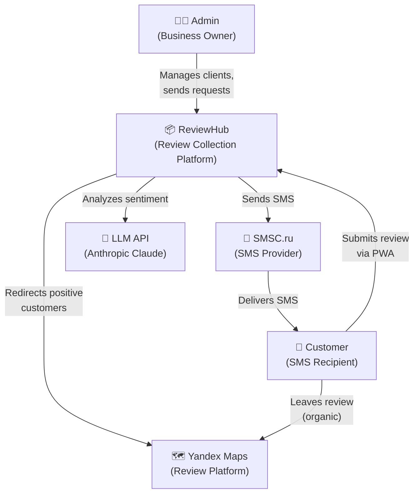
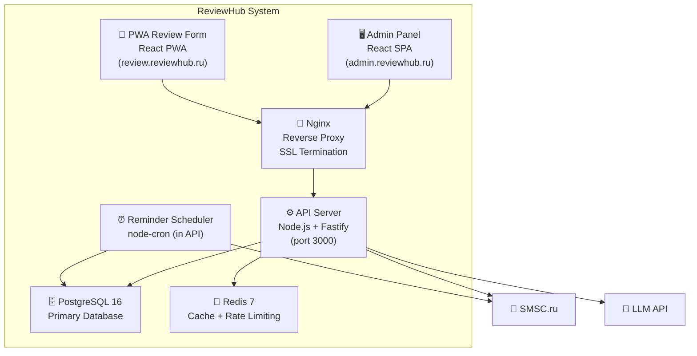
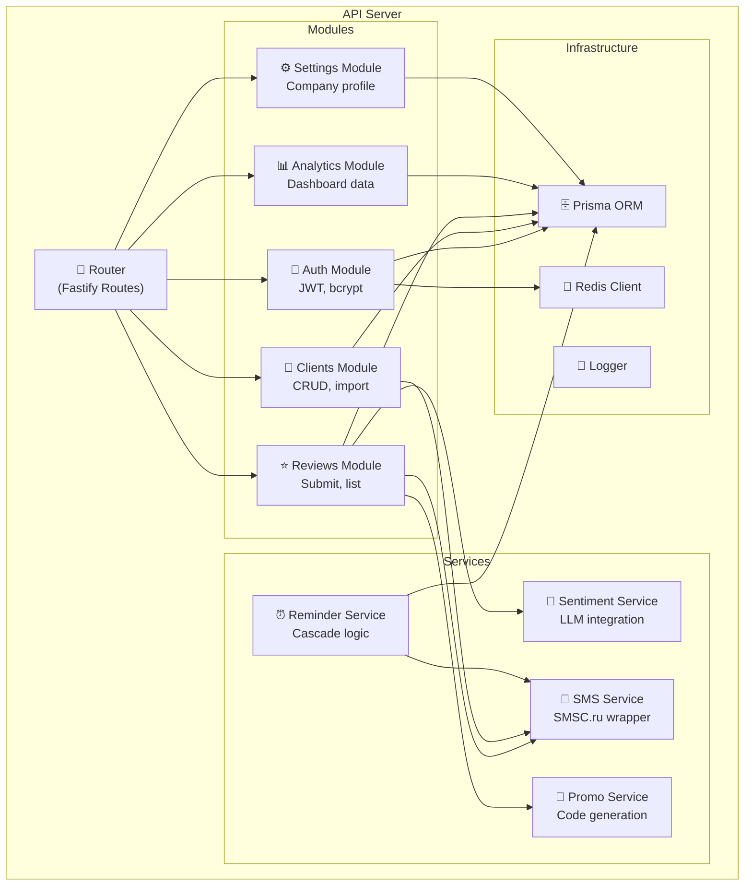
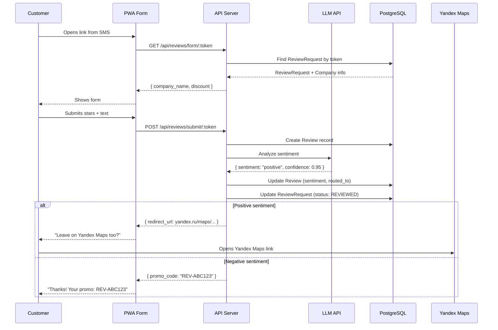
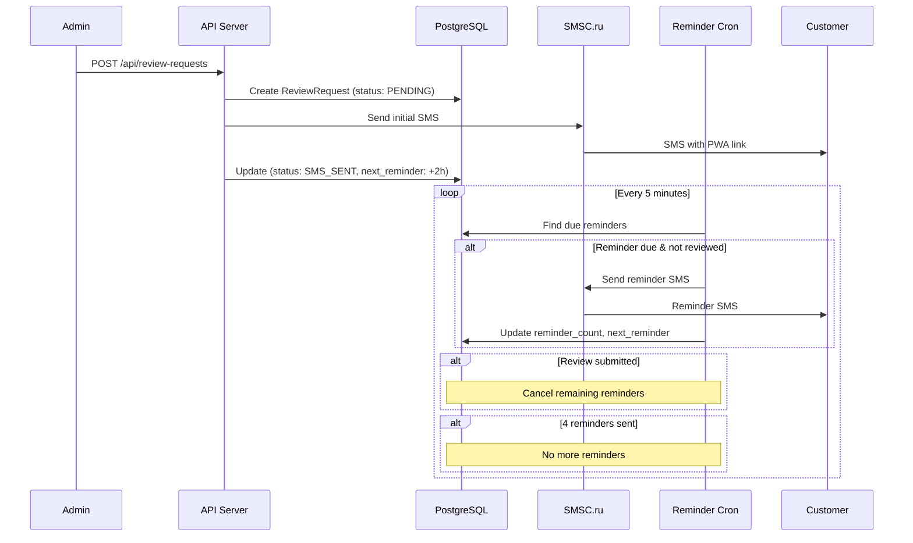

# C4 Diagrams: ReviewHub

## Level 1: System Context

```mermaid
graph TB
    Admin["🧑‍💼 Admin<br/>(Business Owner)"]
    Client["👤 Customer<br/>(SMS Recipient)"]

    ReviewHub["📦 ReviewHub<br/>(Review Collection Platform)"]

    SMSC["📱 SMSC.ru<br/>(SMS Provider)"]
    LLM["🤖 LLM API<br/>(Anthropic Claude)"]
    YandexMaps["🗺️ Yandex Maps<br/>(Review Platform)"]

    Admin -->|"Manages clients,<br/>sends requests"| ReviewHub
    Client -->|"Submits review<br/>via PWA"| ReviewHub
    ReviewHub -->|"Sends SMS"| SMSC
    SMSC -->|"Delivers SMS"| Client
    ReviewHub -->|"Analyzes sentiment"| LLM
    ReviewHub -->|"Redirects positive<br/>customers"| YandexMaps
    Client -->|"Leaves review<br/>(organic)"| YandexMaps
```

## Level 2: Container Diagram

```mermaid
graph TB
    subgraph "ReviewHub System"
        AdminSPA["🖥️ Admin Panel<br/>React SPA<br/>(admin.reviewhub.ru)"]
        PWA["📱 PWA Review Form<br/>React PWA<br/>(review.reviewhub.ru)"]
        Nginx["🔀 Nginx<br/>Reverse Proxy<br/>SSL Termination"]
        API["⚙️ API Server<br/>Node.js + Fastify<br/>(port 3000)"]
        DB["🗄️ PostgreSQL 16<br/>Primary Database"]
        Redis["💾 Redis 7<br/>Cache + Rate Limiting"]
        Cron["⏰ Reminder Scheduler<br/>node-cron (in API)"]
    end

    SMSC["📱 SMSC.ru"]
    LLM["🤖 LLM API"]

    AdminSPA --> Nginx
    PWA --> Nginx
    Nginx --> API
    API --> DB
    API --> Redis
    API --> SMSC
    API --> LLM
    Cron --> DB
    Cron --> SMSC
```

## Level 3: Component Diagram (API Server)

```mermaid
graph TB
    subgraph "API Server"
        Router["🔀 Router<br/>(Fastify Routes)"]

        subgraph "Modules"
            Auth["🔐 Auth Module<br/>JWT, bcrypt"]
            Clients["👥 Clients Module<br/>CRUD, import"]
            Reviews["⭐ Reviews Module<br/>Submit, list"]
            Analytics["📊 Analytics Module<br/>Dashboard data"]
            Settings["⚙️ Settings Module<br/>Company profile"]
        end

        subgraph "Services"
            SMSService["📱 SMS Service<br/>SMSC.ru wrapper"]
            SentimentService["🤖 Sentiment Service<br/>LLM integration"]
            ReminderService["⏰ Reminder Service<br/>Cascade logic"]
            PromoService["🎫 Promo Service<br/>Code generation"]
        end

        subgraph "Infrastructure"
            Prisma["🗄️ Prisma ORM"]
            RedisClient["💾 Redis Client"]
            Logger["📝 Logger"]
        end
    end

    Router --> Auth
    Router --> Clients
    Router --> Reviews
    Router --> Analytics
    Router --> Settings

    Reviews --> SentimentService
    Reviews --> SMSService
    Reviews --> PromoService
    Clients --> SMSService
    ReminderService --> SMSService

    Auth --> Prisma
    Clients --> Prisma
    Reviews --> Prisma
    Analytics --> Prisma
    Settings --> Prisma
    ReminderService --> Prisma

    Auth --> RedisClient
```

## Data Flow: Review Submission

```mermaid
sequenceDiagram
    participant C as Customer
    participant PWA as PWA Form
    participant API as API Server
    participant LLM as LLM API
    participant DB as PostgreSQL
    participant YM as Yandex Maps

    C->>PWA: Opens link from SMS
    PWA->>API: GET /api/reviews/form/:token
    API->>DB: Find ReviewRequest by token
    DB-->>API: ReviewRequest + Company info
    API-->>PWA: { company_name, discount }
    PWA-->>C: Shows form

    C->>PWA: Submits stars + text
    PWA->>API: POST /api/reviews/submit/:token
    API->>DB: Create Review record
    API->>LLM: Analyze sentiment
    LLM-->>API: { sentiment: "positive", confidence: 0.95 }
    API->>DB: Update Review (sentiment, routed_to)
    API->>DB: Update ReviewRequest (status: REVIEWED)

    alt Positive sentiment
        API-->>PWA: { redirect_url: yandex.ru/maps/... }
        PWA-->>C: "Leave on Yandex Maps too?"
        C->>YM: Opens Yandex Maps link
    else Negative sentiment
        API-->>PWA: { promo_code: "REV-ABC123" }
        PWA-->>C: "Thanks! Your promo: REV-ABC123"
    end
```

## Data Flow: SMS Cascade

```mermaid
sequenceDiagram
    participant Admin as Admin
    participant API as API Server
    participant DB as PostgreSQL
    participant SMSC as SMSC.ru
    participant Cron as Reminder Cron
    participant Client as Customer

    Admin->>API: POST /api/review-requests
    API->>DB: Create ReviewRequest (status: PENDING)
    API->>SMSC: Send initial SMS
    SMSC->>Client: SMS with PWA link
    API->>DB: Update (status: SMS_SENT, next_reminder: +2h)

    loop Every 5 minutes
        Cron->>DB: Find due reminders
        alt Reminder due & not reviewed
            Cron->>SMSC: Send reminder SMS
            SMSC->>Client: Reminder SMS
            Cron->>DB: Update reminder_count, next_reminder
        end
        alt Review submitted
            Note over Cron,DB: Cancel remaining reminders
        end
        alt 4 reminders sent
            Note over Cron,DB: No more reminders
        end
    end
```
